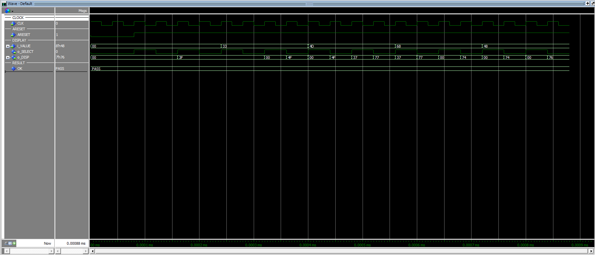
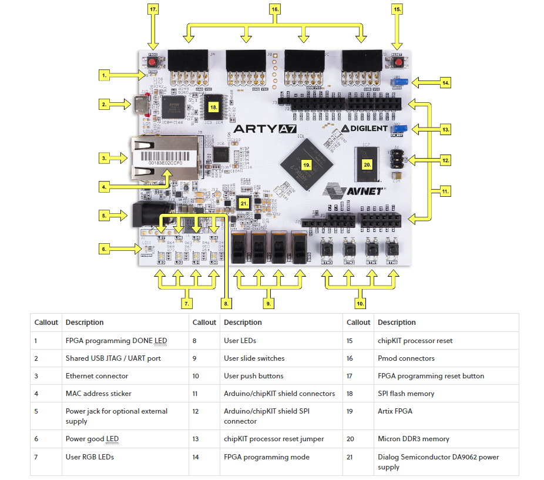
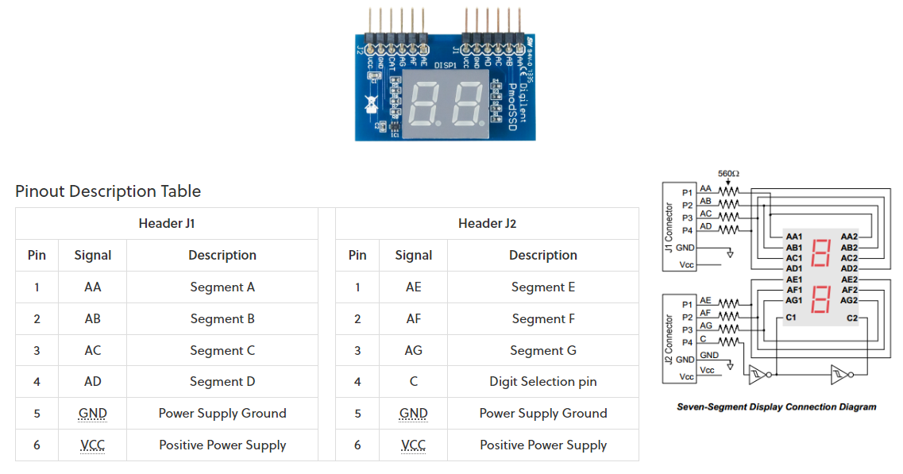
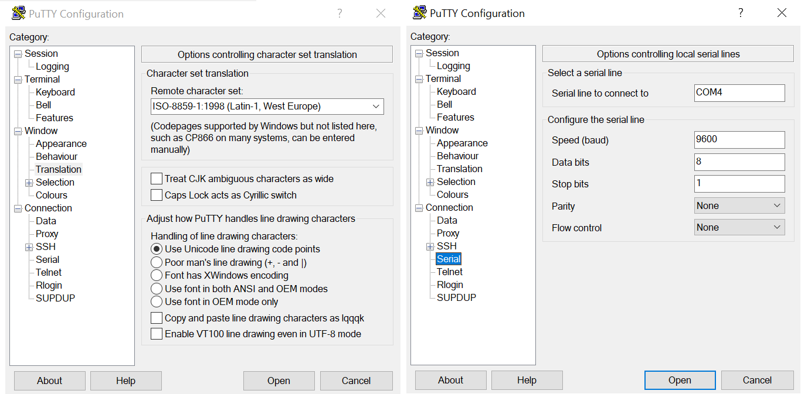
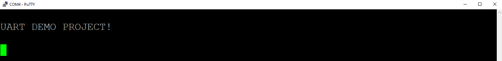
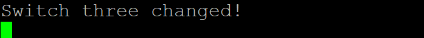
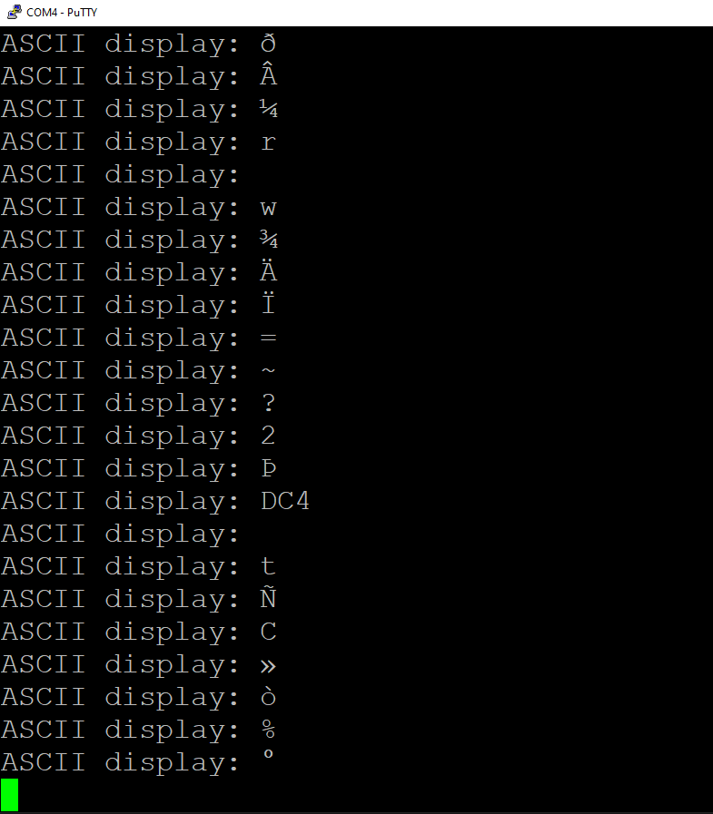

# UART Firmware Demostration Project

Created by: Michael Oxford

Date: 14/09/2023

## Description

This git repo contains the project files, source and simulation code created as part of a training project, getting familiar with VHDL, Xilinx Vivado and Mentor Graphics (now Siemens EDA) ModelSim. 

The original aim of the project was to create a Universal Asynchronous Transmitter Receiver driver (UART) running on an Xilinx Arty development board using a 25MHz clock. The settings for the UART driver should be configurable, namely the baud rate. The scope of work was eventually expanded to make use of the onboard devices (e.g. buttons, switches) and be able to communicate with a client (Putty) over the USB port. 

All code written for this project uses the Very High Speed Integrated Circuit Hardware Description Language (VHDL) 2008 or later. Many of the fundamental aspects of the language have been applied here to give examples of their usage:

- IEEE ```std_logic``` libraries;
- Declaring entities with the individual input/output ports using ```port```;
- Declaring the architecture (```architecture ... of ... is```);
- Types of archtitecture (Register Transfer Level, or RTL, Behavioural, Structural)
- Signals;
- Variables;
- Constants;
- Processes and sensitivity lists;
- Data types (e.g. ```std_logic```, ```unsigned```, etc.) and their respective operations;
- Data type conversion;
- Combinational vs. sequential logic;
- Declaring custom data types (```type ... is ...```);
- Memories;
- Conditionals (```if...elsif...else...end if```);
- Conditional signal assignment (```... <= ... when ... else ...```)
- Cases (```case ... is when ... end case```);
- Defining functions (```function ... return ... is ... end function ...```);
- Finite State Machines (FSMs);
- Declaring components and instantiation (```component ... is ...```);
- Port mapping;
- Generics;
- Loops (```for ... in ... to ... loop ... end loop```);
- Non-synthesisable code useful for testbenching (e.g. ```wait```, ```report```);
- TEXTIO libraries;
- Reading/writing from/to files;
- Hierarchical design.

## Navigation

All defined module/sub-module are located in: ```uart\uart.srcs\sources_1\imports```. The ```top``` module should be seen as the top-level design for the application containing and handling all the other lower-level modules.

Each module is contained in its own folder, containing the following sub-folders:
- ```hdl``` - Contains the ```.vhd``` source file;
- ```scripts``` - Contains batch and Tool Command Languge (TCL) scripts to run the simulations with;
- ```tb``` - Contains the ```.vhd``` testbench file for simulation.

There is a single ```.xdc``` script found at ```uart\uart.srcs\constrs_1\imports\constraints``` containing the commands to bind certain ports to the pins on the target board. Any unused pins are commented out.

For a useful reference, images of the simulation waves generated from running a module's testbench can be found in ```modelsim_waves```.

## Project Tools

All source code was written in ***Xilinx Vivado (2018.2)***. Assuming that Vivado has already been installed on your device, to open up the project, simply click ```uart.xpr```.

All simulations for this project has been performed using ***ModelSim (DE-64 10.7)***. Assuming that Modelsim has already been installed on your device, to run a testbench for any module, run the batch file ```<MODULE>_sim.bat``` found in the corresponding ```scripts``` folder. For an example, to see the simulation waves when testing the ```ascii_diplay``` module, the output from Modelsim when running the scripts should look something like this:



To change the display output, edit the file ```<MODULE_NAME>_wave.do``` with the appropriate TCL commands. It is recommended not to touch ```<MODULE_NAME>_sim.do``` as this compiles all the dependencies to get the required behaviour. When running the simulation, a ```sim``` folder will get created containing the output files (this folder will be ignored by git).

## Limitations of the Code

The only thing the application is lacking is a configurable data length for the UART packet because there was no real need to load any more than 8 bits of the data for our purposes (especially when we want to communicate with Putty).

## Development Board

The application has been designed to run on an Arty-A7 100T FPGA development board. It includes: 

- 100MHz clock source;
- Four configurable push buttons (BTN[0-3]);
- Four configurable LEDs (LD[4-7]);
- Four configurable RGB LEDs (LD[0-3]);
- Four configurable switches (SW[0-3]);
- One dedicated reset button (RESET);
- USB-UART bridge;
- Four sets of Pmod connectors (J[A-D]);
- Arduino/chipKIT shield connectors;
- JTAG and Quad-SPI Flash.



Addtionally, the application utilises two Pmod seven segment displays (SSD) which print hex and ASCII characters (where appplicable).



## Setting up

To get the most out of the application, be sure your decive has Putty installed. We only explain how to set things up using the board and displays described in the previous section. It is the responsibility of the reader to figure out how to set up their own devices and run the application on it. 

1) Connect one Pmod SSD to the top level JA & JB connectors (display side up!)
2) Connect another Pmod SSD to the top level JC & JD connectors
3) Be sure that all switches are by default set of "OFF"
4) Connect the board to your device via USB
5) Get the "IO0" and "IO1" channels using a piece of metal wire; these pins will be configured to be the UART Tx and Rx pins
6) Be sure that the board is powered on using either the USB or power jack
7) On Putty, Run a session specifying the desination to connect to as the port connecting the board to the device with the following settings (See the images as a reference):
    - Connection type: Serial
    - Speed: 9600
    - Character Set Translation (under "Window -> Translation"): ISO-8859-1: 1998
    - Serial line configuration (under "Connection -> Serial"):
        - Speed (baud): 9600
        - Data bits: 8
        - Stop bits: 1
        - Parity: None
        - Flow control: None



8) Program the board with the compiled application (```.bit``` or ```.bin``` file) using Vivado. We do not explain how to do this here but the Diligent website has a good guide ([link](https://digilent.com/reference/learn/programmable-logic/tutorials/arty-programming-guide/start))

## Using the Application

### Byte Sources

The application has two internal modules that output bytes periodically; one generates pseudorandom bytes using multiple byte registers; the other outputs only two bytes, one of them being a printable ASCII character. The user can switch between them by toggling switch SW1. All generated bytes get displayed to one of the SSDs in hex format. Upon startup, both byte sources start with the initial output 0xFF so the display should show "FF".

### Sending Bytes Over UART

To load the byte ready for transmission, press down on button BTN0 and this will trigger the UART to transmit serial data from Tx to Rx over the wire going to the other SSD (upon startup, this display should show "00"). If the byte is a printable ASCII, the character will be displayed on the second SSD, otherwise it will display "NA". The zeroed byte is treated as special and the SSD will display "00" upon receiving it. To continuously transmit bytes, simply hold down BTN0. LED LD7 will turn on so long as BTN0 is pressed down. If LED LD4 is turned on, this indicates that the Tx and Rx are busy.

### Baud Rate

The UART is configurable to two speeds: 9600 bds and 115200 bds. You can select between the two using switch SW0. If LED LD5 is turned, the UART is using 115200 bds.  

### Parity Checking

The UART can perform parity checking. Tx shall append additional bits to the UART packet which Rx uses to determine if the data parity matches the parity bit. If it does match, the byte of data is outputted from Rx, otherwise it will "drop" the packet and output zeroed data to indicate this is the case (note the output is zeroed out on application startup). To toggle parity checking on/off, simply press button BTN1. If LED LD6 is turned on, this indicates that parity checking is enabled.  

### Testing the Parity Checking Feature

Normally the parity checking should not fail as we are only transmitting over a very short distance and there is less likelihood of "single error upsets". To actually test the code performing the parity checking, a test can be enabled but only when parity checking is enabled. To toggle this test on/off, ensure that parity checking on and then simply press button BTN2. If LED LD0 is turned on (red light), this indicates that the test is activated. So long as the test is activated, tranmitted data will always be dropped Rx-side (the test actually involves inverting a single data bit before transmission but does not update the parity bit, causing a mismatch).

### Communicating with Putty

When you open a Putty session with the correct configuration (See the [Setting Up](#setting-up) section for details, step 7)), the terminal should display this message:



Press BTN3 to display the following message:


Toggle SW3 to display the following message:



Toggle switch SW3 on to continuously print the ASCII character of the generated byte. The control bytes (0x00 -> 0x1F) are regarded as special and so a unique abbreviation gets printed instead to represent them:



Note that depending on the byte there may not be a ASCII character mapped to it and so nothing will get printed, however this should not corrupt the message being displayed or any future ones. It is also useful to note that LED LD9 flashes when serial data is being transmitted over the USB.

## Useful References

- [Nandland.com](https://nandland.com/) (See FPGA-101 section)
- [Arty A7 Reference Manual](https://digilent.com/reference/programmable-logic/arty-a7/reference-manual?redirect=1)
- [FPGA Designs with VHDL](https://vhdlguide.readthedocs.io/en/latest/vhdl/overview.html)
- [Arty A7 General I/O Demo](https://digilent.com/reference/programmable-logic/arty-a7/demos/gpio)
- [Pmod SSD Reference Manual](https://digilent.com/reference/pmod/pmodssd/reference-manual)
- [Arty Programming Guide](https://digilent.com/reference/learn/programmable-logic/tutorials/arty-programming-guide/start)
- [SSD example source code](https://github.com/timothystotts/fpga-serial-acl-tester-1/blob/main/ACL-Tester-Design-Single-Clock-VHDL/RTL/ssd_display.vhdl)
- [UART Protocols and Applications in Embedded Systems](https://www.embedded.com/understanding-the-uart/)
- [VHDL-2008: Easier to use](https://www.doulos.com/knowhow/vhdl/vhdl-2008-easier-to-use/)
- [Introduction to Clock Domain Crossing: Double Flopping](https://www.allaboutcircuits.com/technical-articles/introduction-to-clock-domain-crossing-double-flopping/) (If you are interested)